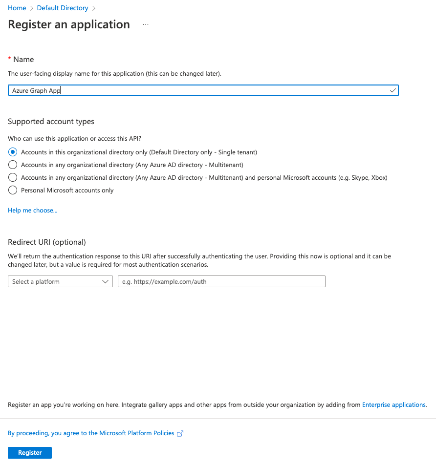
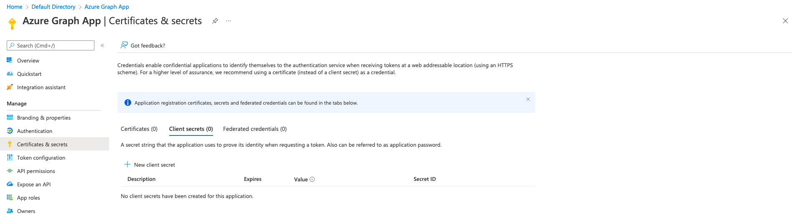

# Integrate Azure AD with WSO2 API Manager

This explains how to integrate Azure AD as a third-party Key Manager with WSO2 API Manager (v3.2.0 onwards).

## Build & Deploy

To build the project, execute the following `mvn` command from the root directory of the project

```sh
mvn clean install package
```

After successful build, copy the built JAR artifact from `<apim-km-azure>/components/azure.key.manager/target` directory and place it inside the `<apim>/repository/components/dropins` directory of the WSO2 API Manager server.

This step requires a server restart to take effect on the changes and to enable the Azure AD Key Manager component in API Manager.

## Configure Azure AD

Given instructions are pre-requisite steps to configure Azure AD to integrate with WSO2 API Manager.

> Since, Microsoft or Azure doesn't provide any OpenID Configuration endpoints to dynamically register clients, this implementation focuses on using the Microsoft's GraphAPI to perform the same to an extent

### Create Azure AD Application

Follow the below given instructions to create an Azure AD Application to configure with the API Manager server

- Navigate to `App registrations`
- Click on `New registration`
- Name: `Azure Graph App`
- Supported account types: `Accounts in this organizational directory only`
- Click `Register`

    

Once the application is created successfully, follow the below steps to generate a client secret

- Go to `Certificates & secrets` > `Client secrets`
- `New client secret`
- Description: `WSO2 API Manager`
- Expires: `Custom` (and provide a longer a value)

    

Go back to the overview page of the AD Application and click on `Endpoints` button in the top navigation bar to display all OAuth 2.0 related endpoints. Make a copy of the following endpoints, as we will be using these to configure the Key Manager in the API Manager server

- OpenID Connect metadata document
- OAuth 2.0 authorization endpoint (v2)
- OAuth 2.0 token endpoint (v2)
- Microsoft Graph API endpoint

Also, make a note of the following IDs from the overview page of the AD Application

- Application (client) ID
- Directory (tenant) ID

Next, navigate to `API Permissions` and perform the following

- Click `Add a permission`
- Select `Microsoft Graph` from the panel
- Select `Application permissions`
- Expand `Application` and select all permissions
- Click on `Add permissions`
- Once done, click on `Grant admin consent for Default Directory` and select `Yes`

## Configure WSO2 API Manager

Start the API Manager server and log-in to the Admin portal to configure Azure AD as a Key Manager.

### Configure Key Manager

- Click on `Key Managers` from the side panel and then click `Add Key Manager`
- Fill the following
  - Name: `AzureAD`
  - Display Name: `Azure AD Key Manager`
  - Description *(optional)*
  - Key Manager Type: `Azure AD`
  - Well-known URL: paste the `OpenID Connect metadata document` URL collected from the endpoints and click on `Import`
  - Client Registration Endpoint: paste the `Microsoft Graph API endpoint`
  - Introspection Endpoint: paste the `OAuth 2.0 token endpoint (v2)` URL *(token introspection is not supported in Azure AD)*
  - Revoke Endpoint: paste the `OAuth 2.0 token endpoint (v2)` URL *(token revocation is not supported in Azure AD)*
- Grant Types: `client_credentials`
- Connector Configurations
  - Microsoft Graph API Endpoint: paste the `Microsoft Graph API endpoint`
  - Client ID: paste the `Application (client) ID`
  - Client Secret: paste the client secret value that is generated
  - Tenant ID: paste the `Directory (tenant) ID`
- Click on `Add`

### Create an Application & Generate Keys

Next, log-in to the Devportal and navigate to `Applications` section

- Click on `Add New Application`
- Fill the required information and click on `Add`
- Once created, navigate to the `Production Keys` section of that Application
- Select the `Azure AD Key Manager` and click on `Generate Keys`
